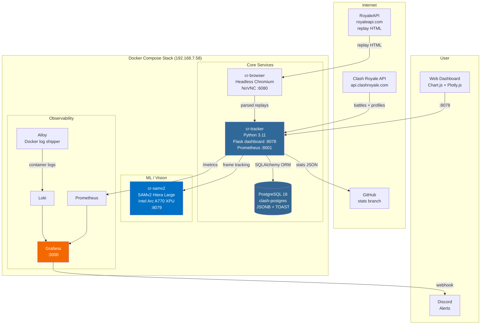
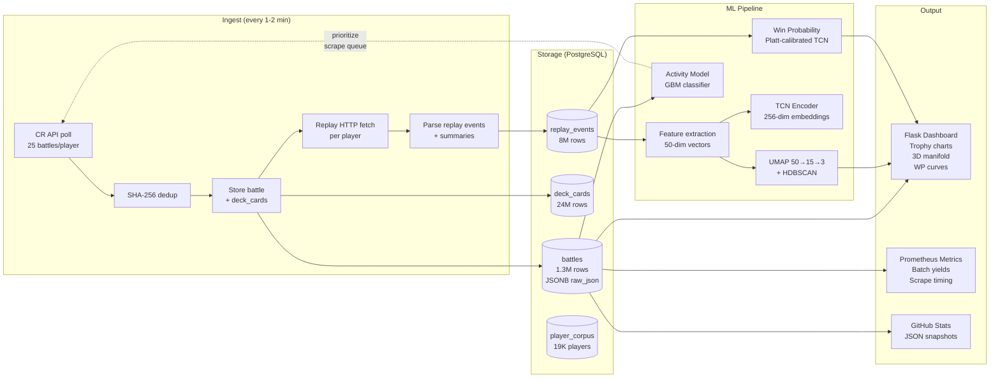
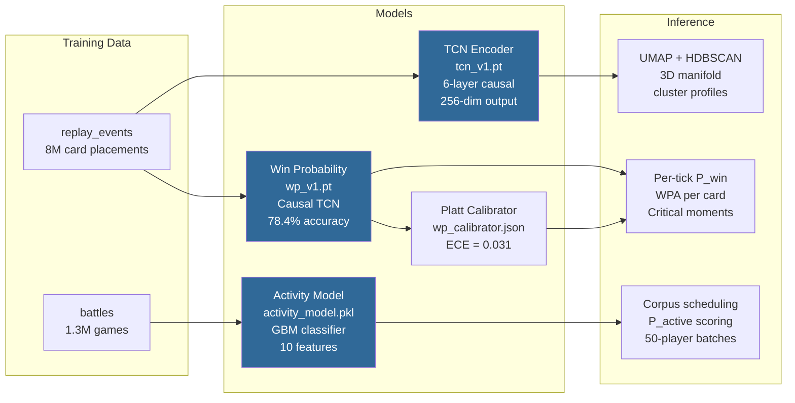

# Architecture

## System Overview

## Data Pipeline

## ML Models

## Cron Schedule

| Interval | Job | Description |
|----------|-----|-------------|
| */2 min | `personal_combined.sh` | Fetch personal battles + scrape replays |
| */1 min | `corpus_combined.sh` | 50-player batch: battles + replays (flock guard) |
| */5 min | `publish_wrapper.sh` | Push stats JSON to GitHub |
| */5 min | `wp_infer_new.sh` | Incremental WP inference on new replay games |
| Hourly | `corpus_nemeses.sh` | Add opponents from personal losses to corpus |
| Daily 3am | `corpus_discover.sh` | Network discovery from opponent tags |
| Weekly Mon 6am | `corpus_update.sh` | Refresh top-ladder player list |
| Weekly Mon 6:30am | `train_activity.sh` | Retrain activity model |
| Weekly Mon 7am | `corpus_locations.sh` | Regional leaderboard discovery |
| Weekly Sun 4am | `tcn_train.sh` | Retrain TCN encoder |
| 6-hourly | `sim_refresh.sh` | Refresh Monte Carlo simulation results |
